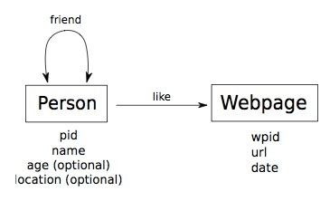

<html>
<head><meta http-equiv="Content-Type" content="text/html; charset=UTF-8">
 <title>Graph Data Benchmark (GDBench)</title>
</head>

<body>

<h1>Graph Data Benchmark (GDBench)</h1>

A micro-benchmark for benchmarking graph databases based on a social network data model.   

<h2>Introduction</h2>

GDBench is a microbenchmark oriented to evaluate the performance of  
graph database systems based on social network applications. 
The benchmark includes a generator that synthetically creates graphs resembling real world
social networks, and define a set of representative graph and use-case oriented queries, 
such as getting the friends of a friend, 
looking for similar like pages, or finding shortest paths between people. 

<h2>Structure of the benchmark</h2>

<b>Data model.</b>

GDBench is based on the data model described in Figure 1.
The data model considers two types of entities, person and Webpage. 
Persons are linked to other persons by a "friend" relationship, indicating that those 
two persons are friends. 
On the other side, persons are linked to Webpages by a "like" relationship 
indicating that a person likes a Webpage. 
The attributes of a person are 
his/her identifier (pid), 
his/her name, and two optional fields, the age and the location. 
Finally, a Webpage has an attribute wpid as identifier, its URL, 
and optionally a creation date.

<figure>

<figcaption>Figure 1. Data model of GDBench</figcaption>
</figure>

<b>Queries.</b>

A micro-benchmark is used to evaluate the individual performances of basic operations 
(such as joins and aggregations in relational databases), rather than more complex queries. 
In the context of graph databases we find several queries which can be considered 
essential in graphs. 
We group them in adjacency, reachability, pattern matching and summarization queries. 
Also, we add select queries which are also relevant in the context of graph databases.

Based on a brief analysis of the user interaction with a social network system (Facebook), 
and taking into account the essential graph queries defined above, 
we defined a representative query mix in the following Table. 
In spite of the apparent similarity among some of the selected queries, 
they present simple variations that may be implemented differently, and hence
optimized, by the database systems.
 

<table border="1">
<tbody>
<tr>
<td>Q</td>
<td>Description</td>
<td>Type</td>
</tr>
<tr>
<td>1</td>
<td>People having a name N</td>
<td>Select</td>
</tr>
<tr>
<td>2</td>
<td>People that likes a given Web page W</td>
<td>Adjacency</td>
</tr>
<tr>
<td>3</td>
<td>The Web pages that person P likes</td>
<td>Adjacency</td>
</tr>
<tr>
<td>4</td>
<td>The name of the person with a given PID</td>
<td>Select</td>
</tr>
<tr>
<td>5</td>
<td>The friends of the friends of a given person P</td>
<td>Reachability</td>
</tr>
<tr>
<td>6</td>
<td>The Web pages liked by the friends of a given person P</td>
<td>Reachability</td>
</tr>
<tr>
<td>7</td>
<td>Get people that likes a Web page which a person P likes</td>
<td>Reachability</td>
</tr>
<tr>
<td>8</td>
<td>Is there a connection (path) between people P1 and P2?</td>
<td>Reachability</td>
</tr>
<tr>
<td>9</td>
<td>Get the shortest path between people P1 and P2</td>
<td>Reachability</td>
</tr>
<tr>
<td>10</td>
<td>Get the common friends between people P1 and P2</td>
<td>Pattern matching</td>
</tr>
<tr>
<td>11</td>
<td>Get the common Web pages that people P1 and P2 like</td>
<td>Pattern matching</td>
</tr>
<tr>
<td>12</td>
<td>Get the number of friends of a person</td>
<td>Summarization</td>
</tr>

</tbody>
</table>

<b>Performance metrics.</b>

In the literature of benchmarking databases systems several performance metrics 
are considered: 
throughput, which is the rate at which operations are complete (e.g., transactions per second); 
response time of the operation, which is the elapsed time for the execution of the operation; 
and cost metric, which normalizes the price of a system with respect to the throughput. 
We concentrate our interest on measuring the response time for load and query operations.

<ul>
<li><b>Data loading Time.</b> 
It refers to the time that a database system needs to load the data from the source file. 
This metric includes any time spend by the system to built index structures and statistical data. 
The loading time is measured in milliseconds.</li>

<li><b>Query execution time.</b> 
This is the central performance metric of the benchmark. 
It refers to the time spend by a database system to execute a single query. 
The execution time of a query type Q is given by the average time of executing several 
instances of Q. The execution time of a query instance is measured in microseconds. 
In order to obtain measures similar to those of a working server, 
the benchmark executes a warm-up run before executing the timed query. 
The warm-up executes all the query instances once before the timed execution 
to populate the database cache system.</li>

</ul>

<b>Graph data and test data generation.</b>

We have developed a java application which allows the generation of syntetic graph data 
following the social network structure defined above.
First we developed a general-purpose graph data generator based on the 
Recursive Matrix (R-Mat) model, but optimized to generate large graphs in a streamed fashion 
(i.e., reducing memory restrictions). 

To produce synthetic social-network data we take as reference the information published by 
current social networks applications, in particular Facebook, 
The number of users in Facebook is significantly larger than the number of webpages.
To simulate this, we set 80% of the nodes as persons and 20% as webpages. 
The identifier of a person node (i.e., the attribute pid) is an integer value in 
the range [1, N × 0.8], where N is the number of nodes in the graph. 
The names of persons and locations are selected randomly from dictionaries including
5494 first names, 88799 last names, and 656 locations. 
Hence, the probability of having duplicated pairs of these two 
attributes depends on the size of the graph and the distributions used. 
 The occurrence of attributes age and location follows probabilities
0.6 and 0.3 respectively. 
The age of a person is a random integer between 10 and 73. 
The identifier of a node webpage (i.e., the attribute wpid) 
is an integer in the range [(N × 0.8) + 1, N ]. 
The attribute URL follows the pattern http://www.site.org/webpageID.html 
where ID is the wpid of the webpage. 
The probability of including a random creation date for a webpage is 0.6.
Resembling the data generator of the benchmark for the Facebook social graph 
(<a href="https://www.facebook.com/notes/facebook-engineering/linkbench-a-database-benchmark-for-the-social-graph/10151391496443920">LinkBench</a>), 
we use the general-purpose method for graph generation to obtain power-law distributions 
for the edges corresponding to relationships friend and like.

<b>Social network data generator</b>

The data generator is available as the java application <a href="http://campuscurico.utalca.cl/~rangles/gdbench/GDGenerator.zip">GDGenerator</a>.
The output of the data generator is a data file and a test data file. 

The data file, named <b>sndata.*</b>, contains the graph data in an specific format. 
The data format used by default is a non-standard compressed format used called graphdata (*.gd).

The test data file, named <b>testdata.xml</b>, is an XML file 
containing test data, that is data to be used in the creation of query instances. 
For example, if the benchmark issues 10,000 instances of Q1, then the data file contains a list of 10,000 names.
The test data is grouped as follows: 
IDs of people (used for queries Q3, Q4, Q5, Q6, Q7, Q12); 
names of people (used for query Q1); 
IDs of webpages (used for query Q2); 
pairs of IDs <person,person> such that these two people are connected
by a “friend” relationship (used for query Q10); 
pairs of IDs <person,webpage> such that there is a relationship
“like” between the person and the webpage; 
and 
pairs of IDs <person,person> such that there is a path between 
them (used for queries Q8 and Q9).
The selection of test data runs in parallel to the graph data generation process. 
Hence, the data is generated as a stream of query instances.
</person,person></person,webpage></person,person>

The current version of the data generator allows to specify three parameters: 

<ul>
<li>the number of nodes in the graph (by default, 80% of the nodes are people and 20% webpages);</li> 
<li>the format of the output data file (gd = graph data -default-, gml = Graphml and n3 = Notation3-RDF);</li>
<li>the number of samples in the test data file (by default 100 samples for each group of test data).</li> 
</ul>

<b>The GDBenchmark Java Library.</b>

The benchmark is available as the java library <a href="http://campuscurico.utalca.cl/~rangles/gdbench/GDBenchmark.jar">GDBenchmark.jar</a>. 
This library allows the execution of data loading and query tests.
The source code of the java library is available <a href="http://campuscurico.utalca.cl/~rangles/gdbench/GDBenchmark-src.zip">here</a>

 The main class of GDBenchmark is <b>TestDriver.java</b>. 
This is an abstract class that defines an interface to operate with a database system.
It includes methods for 
database definition (createDB, openDB, closeDB), 
data loading (openTransaction, closeTransaction, insertPerson, insertWebpage, insertFriend, insertLike) 
and 
query execution (Q1, ..., Q12). 

<h2>How to evaluate a database system with GDBench</h2>

The procedure to evaluate the performance of a database system, 
by using the benchmark described above, is defined by the following steps.

<b>Data generation.</b>

The first step is the generation of the data by using the graph data generator <a href="http://campuscurico.utalca.cl/~rangles/gdbench/GDGenerator.zip">GDGenerator</a>.
It results in the data file sndata.gd and the test data file testdata.xml. 

<b>Test driver implementation.</b>

It consists in the development of a java class that implements the class TestDriver 
with the code corresponding to the target database system.
We provide the class <a href="http://campuscurico.utalca.cl/~rangles/gdbench/MyTestDriver.java">MyTestDriver.java</a> as an example of such class.

<b>Data loading test.</b>
 

The benchmark allows transactional or bulk data loading.

 
Transactional data loading is supported by calling the method runDataLoading() 
provided by the class MyTestDriver (and implemented in the class TestDriver) .
The application reads the data file sndata.gd and use transactions to insert the 
data in the target database, according to the data loading methods defined in the 
class MyTestDriver (recall that these methods must be implemented by the user).

Bulk data loading depends on the support of a database system to read specific data formats. 
For example, RDF databases are able to read N3 and RDF-XML files. 
Unfortunately, current graph database systems define different and non-standard data formats, 
therefore different data loaders must be developed (GraphML is not useful here). 
The benchmark includes a tool (<a href="http://campuscurico.utalca.cl/~rangles/gdbench/GDExporter.jar">GDExporter</a>) to convert a compressed data file into 
different data formats. 
In the context of this work, we have implemented the conversion to a PostgreSQL dump 
encoding SQL instructions, and we plan to extend this tool to support other data formats.

<b>Query execution test.</b>
 

The execution of queries requires of the GDBenchmark Java library 
and the test data file (testdata.xml) created in the data generation step. 
The test consider the execution of 100 instances (default) for each query type, 
however this is a parameter that can be changed by the user. 
When the number of samples available in the test data file is not enough to 
construct all the query instances, then some instances can be repeated. 
The user is able to run the test for a specific query type, or to run the complete query mix. 
Additionally, it is possible to select between a sequential or random order of query instances.

The class MyTestDriver provides the following methods to execute the query test:

<ul>
<li>runQueryTest()   
It allows the execution of 100 instances (default) for each query type. 
</li>
<li>runQueryTest(int instances_for_query, String querymix_type)   
It allows to specify the number of instances for query type and
the type of query mix (either sequential or random).</li>
<li>runQueryTestByQuery(int query_number):   
it allows to restrict the execution to instances of a query type. </li>
<li>runQueryTestByQuery(int query_number, int instances_for_query, String querymix_type)</li>
</ul>

The execution of the query test consider two steps: 
the first step is oriented to prepare the database system (warm-up); 
and the second is devoted to measure the performance of the system. 
In both cases the same query mix is executed.

<b>Execution rules</b>

The implementation of a test driver must hold the following rules:

<ul>
<li>The user is able to choose between transactional or bulk data loading.</li>
<li>The queries must be implemented in the corresponding methods defined by the TestDriver java class.</li>
<li>The number of results for a query must be calculated by traversing the result-set. This restriction does not apply for query Q12 where an aggregate operator can be used.</li>
</ul>

<b>Benchmarking results.</b>
 

The benchmark provides reports for the transactional loading test and the query execution 
test. 
The data loading report includes information about the data loaded 
(e.g., number of nodes and edges) and the total loading time. 
The query execution report contains general and detailed information about the queries 
executed. 
A first part of the report presents, for each query type, the number of 
instances executed plus the total, maximum, minimal and average execution time. 
A second part shows the list of query instances executed during the test, 
including the query type, the input data, the output data, 
and the execution time for query instance.

<b>Implementation samples</b>

An example of Netbeans project that uses the GDBenchmark java library is available <a href="http://campuscurico.utalca.cl/~rangles/gdbench/GDBenchTest.zip">here</a>.

We provide the source code of java projects implementing test drivers for  
<a href="http://campuscurico.utalca.cl/~rangles/gdbench/GDBenchDex.zip">Dex</a> and 
<a href="http://campuscurico.utalca.cl/~rangles/gdbench/GDBenchNeo4j.zip">Neo4j</a>. 

<h2>Experiments</h2>

<ul>
<li>2013/05/17: <a href="http://campuscurico.utalca.cl/~rangles/gdbench/test_2013-05-17/index.html">Results</a> from running GDBench against Dex, Neo4j, RDF-3X, Virtuoso and PostgreSQL.</li>
</ul>

<h2>Acknowledgements</h2>

<b>Creator:</b> <a href="http://ing.utalca.cl/~rangles/">Renzo Angles</a>
 

<b>Collaborators:</b>
 
<ul>
<li>Sebastián Arancibia (DCC, Univ. de Talca): Design and development of initial versions the data generator.</li>
<li>Sergio Silva (DCC, Univ. de Talca): Implementations of test drivers for graph database systems and RDF Stores.</li>
<li>Josep-Lluis Larriba-Pey (<a href="http://www.dama.upc.edu/">DAMA-UPC</a>): Design of the bechmark</li>
<li>David Dominguez (<a href="http://www.sparsity-technologies.com/">Sparsity Technologies</a>): Design of the bechmark</li>
<li>Arnau Prat (<a href="http://www.dama.upc.edu/">DAMA-UPC</a>: Implementation of the data generator and the test drivers.</li>
</ul>

<b>Support:</b>
 
<ul>
<li><a href="http://ri.conicyt.cl/575/article-38780.html">Comparison of Graph Databases and RDF Databases</a>. Initiation into Research, Project No 1070348, Fondecyt, Chile. 2011-2013.</li>
<li><a href="http://www.ldbc.eu/">Linked Data Benchmark Council Project (LDBC)</a>. European Community's Seventh Framework Programme FP7/2007-2013.</li>
</ul>

Last update: June 4, 2013
 

</body></html>
